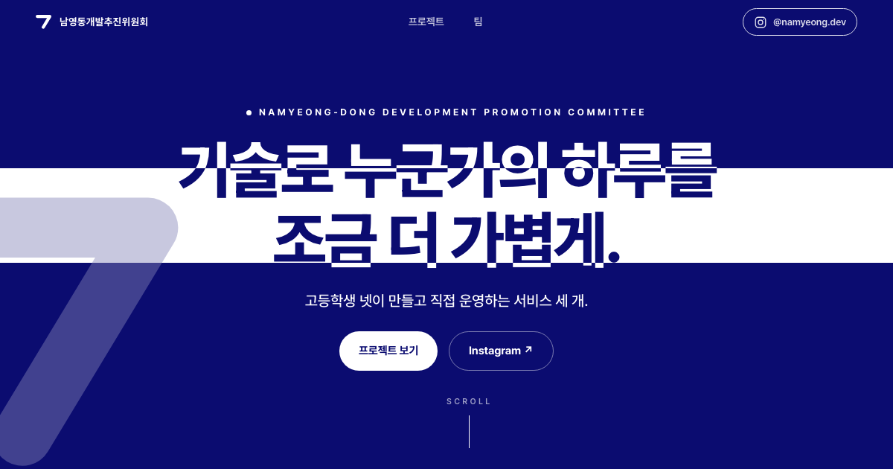

<div align="center">



# 남영동개발추진위원회

기술로 누군가의 하루를 조금 더 가볍게.<br>
고등학생 넷이 만들고 직접 운영하는 서비스 세 개를 소개하는 팀 홈페이지입니다.

**[namyeong.dev](https://namyeong.dev)** · [@namyeong.dev](https://www.instagram.com/namyeong.dev/)


</div>

## 이 저장소

빌드 과정이 없는 순수 정적 사이트입니다. `index.html` / `css/style.css` / `js/main.js`
세 파일이 전부이고, 폴더를 통째로 올리면 그대로 배포됩니다.

스크롤에 맞춰 프로젝트 패널이 움직이고, 외부 링크를 누르면 그 버튼이 브라우저 창으로
커진 뒤 새 탭이 열립니다. 이런 연출은 전부 `js/main.js` 한 파일에 들어 있습니다.

## 소개하는 프로젝트

| | | |
|---|---|---|
| **도우미** | 도움이 필요한 순간, 도움이. | [doumi.beetree.cc](https://doumi.beetree.cc/) |
| **BeeTREE** | 꿀벌처럼 성실하게, 나무처럼 단단하게. | [beetree.cc](https://beetree.cc/) |
| **손가Lock** | 찍는 순간, 개인정보는 잠급니다. | [App Store](https://apps.apple.com/app/id6792205201) |

## 구조

```
index.html          페이지 전체 (히어로 / WHO WE ARE / 프로젝트 / 위원회 명단 / 푸터)
css/style.css       스타일 + 애니메이션
js/main.js          스크롤 인터랙션 엔진
assets/img/         프로젝트 로고, 파비콘, OG 이미지
assets/team/        팀원 프로필 사진
```

## 로컬에서 보기

```bash
python3 -m http.server 4173
```

브라우저에서 http://localhost:4173 접속. 주소 뒤에 `?qa=1` 을 붙이면 모든 애니메이션이
최종 상태로 고정됩니다 (스크린샷·인쇄용).

## 팀원 프로필 사진 넣기

두 단계입니다.

1. `assets/team/` 에 파일을 넣습니다. 권장은 세로형(1:1.16), 500px 이상.
2. `index.html` 의 해당 `<li class="member">` 안 맨 위(`.member-meta` 앞)에 한 줄을 붙입니다.

```html
<div class="member-photo"></div>
```

칸·둥근 모서리·커튼 연출은 CSS 가 알아서 합니다.

| 파일명 | 팀원 |
|---|---|
| `lee-yoonho.jpg` | 이윤호 (팀장) |
| `lee-donggeon.png` | 이동건 |
| `jeong-sua.jpg` | 정수아 |
| `seo-jaeyeon.jpg` | 서재연 |

사진은 이름 옆에 들어가고 표시 크기가 96px 정도라, 원본이 크면 480px 정도로 줄여서
넣으세요. 4MB 짜리를 그대로 두면 그 한 장이 페이지 전체보다 무겁습니다.

사진이 없는 사람은 `` 자체를 두지 않습니다. `loading="lazy"` 도 붙이지 않습니다.
두 규칙 다 이유가 있어서, 자세한 건 [CLAUDE.md](CLAUDE.md#팀-사진) 에 적어 뒀습니다.

## 화살표 마크

인스타그램에 쓰는 화살표가 이 사이트의 시그니처입니다. SVG path 하나라 어디서든
재사용할 수 있습니다 — 파비콘, 네비 로고, 히어로, 푸터에 쓰고 있습니다.

```html
<svg viewBox="0 0 70 62" fill="none" stroke="currentColor"
     stroke-width="13.8" stroke-linecap="round" stroke-linejoin="round">
  <path d="M7 7H63L34 55" />
</svg>
```

**작게 쓰지 마세요.** 작은 크기에서 온전한 형태로 보이면 숫자 `7` 로 읽힙니다.
크게 쓰거나, 인스타그램 포스트처럼 화면 가장자리에서 잘리게 배치하세요.

## 배포

정적 호스팅이면 어디든 됩니다 — GitHub Pages, Vercel, Netlify, Cloudflare Pages.
폴더 전체를 올리면 끝입니다. 현재 운영 서버의 배포 절차는 [CLAUDE.md](CLAUDE.md#배포-ubuntu-서버) 에 있습니다.

두 가지만 주의하세요.

- **`css` 나 `js` 를 고쳤으면 `index.html` 의 `?v=N` 을 두 곳 다 올리세요.** 배포가 파일
  덮어쓰기라, 안 올리면 재방문자는 예전 CSS/JS 를 계속 씁니다.
- **`namyeong.dev` 가 아닌 주소로 올린다면** `index.html` 위쪽의 `og:url`, `og:image` 를
  실제 주소로 바꿔야 합니다. OG 이미지는 히어로를 그대로 찍은 것이라 디자인을 바꾸면
  `assets/img/og.png` 도 다시 만들어야 합니다.

## 참고

- 폰트는 Pretendard Variable + Galmuri11 (jsDelivr CDN).
- 애니메이션은 `prefers-reduced-motion` 을 존중하고, 세션 중에 설정을 켜도 즉시 멈춥니다.
- 디자인 원본 폴더는 저장소에 올리지 않습니다. 사이트가 쓰는 이미지는 전부
  `assets/img/` 에 복사돼 있어서 클론만 해도 그대로 돕니다.
- 코드를 고칠 때 실제로 발목 잡히는 것들(스크롤 스크럽, 코드 타이핑, 모바일 뷰포트,
  외부 링크 전환)은 [CLAUDE.md](CLAUDE.md) 에 모아 뒀습니다.

---

<div align="center">

이 저장소의 코드는 팀 홈페이지 구현이고, 로고·프로필 사진 등 이미지 자산의 권리는
각 프로젝트와 팀원에게 있습니다.

</div>
